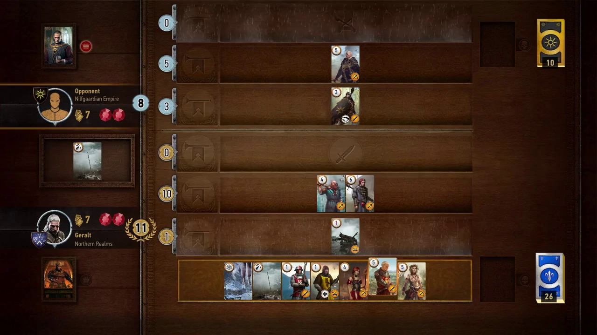
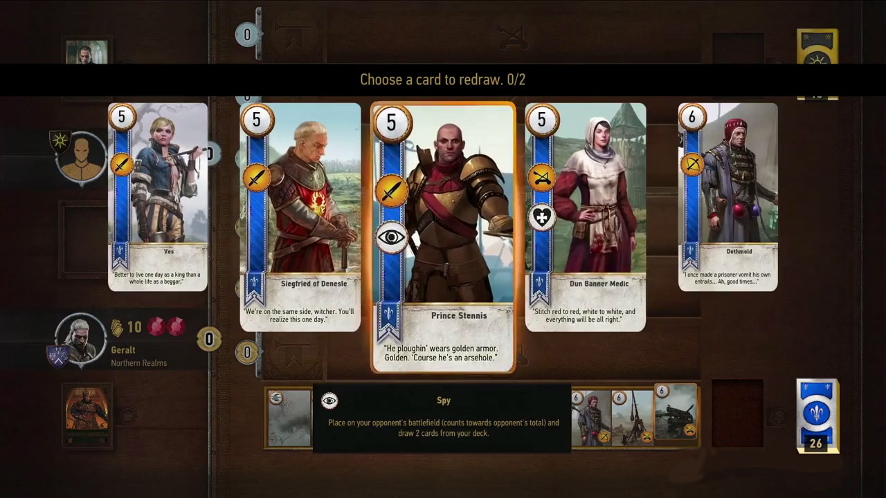

:article: Gwent Guide
:title: {article}
:author: Elias Abel
:mail: admin@meniny.cn
:index: https://meniny.cn/docs/gwent/guide
:images: {index}/images
:doctype: book
:page-layout!:
:sectanchors:
:sectlinks:
:sectnums:
:toc: left
:toclevels: 6
:toc-title: 索引
= {title}

link:../[< Back]

== Introduction

**Gwent** is a dwarven card game you can play in The Witcher 3: Wild Hunt. It’s the favourite pastime of many Northerners, and opponents of varying skill levels can be found all around the world.

In this guide, we’re going to show you how to play Gwent, and where to find worthy adversaries.

You can also check out **link:../cards/[list of all Gwent Cards]** and how to acquire them.

== How To Play Gwent

After starting the game, you’ll have to choose a faction and a leader. Your choice will dictate which cards you’ll be able to use and which faction-specific passive perk you’ll boast. Each faction has at least three variations of their leader.

When you’re done choosing, the game will draw 10 random cards from the deck of your chosen faction. You won’t get to draw any more cards during the game, but you’ll have the chance to re-draw two of them if you’re not satisfied with the results.

The game is played in turns – a coin toss decides who goes first, and each player gets to play a card during his turn, or pass. Once you pass, you don’t get any more turns in that round, so pass only when you’re certain you’ll win or have already
given up that round.

When both players pass, the round ends. The ten cards you’ve drawn at the start need to carry you through the whole game, so don’t toss them all on the board in the first round.

The playing cards have a number in their upper left corner that signifies their strength. Every card you place increases your total strength score, and the player who has a higher score at the end of the round wins it. The game is played in a best-of-three manner – you start with two life gems, and loosing a round destroys one.

There are three types of basic cards – melee, ranged and siege. Each of them goes in a different row on the board, which is important because some special cards affect only certain rows. For instance, weather cards reduce the strength of all units in a certain row (for both players). Some unit cards have special abilities, like increasing the strength of others or reviving dead soldiers.

Finally, you can also have Hero cards in your decks. They are extremely rare, and not without cause – Heroes are units that are immune to special card effects.

== Gwent Factions

From what we’ve seen in the videos, there will be at least three factions – the Northern Realms, the Nilfgaardian Empire and the Scoia’tael. Apart from having different units at their disposal, they have distinct passive perks and leaders.

Passive perks trigger certain events at the beginning or end of a turn. Leaders give players a special ability that can be used once per match. There are at least three variations of every leader, and they have to be unlocked in order to be used.

[%header, cols="^.^a,^.^a,^.^a,^.^a"]
|===
|Faction
|Leader
|Leader ability
|Passive Perk

|**Northern Realms**
|King Foltest
|Pick an Impenetrable Fog from your deck and play it immediately
|Draw a card after you win a round

|**Nilfgaardian Empire**
|Emhyr var Emreis
|???
|Always win ties

|**Scoia’tael**
|???
|???
|???
|===

== Gwent Players

Due to its popularity in the world of The Witcher 3, there are many Gwent players to be found scattered about the Northern Realms. They have different skill levels – some would lose to a rock, while others require you to have a strong deck and a quick wit in order to best them.

Here’s a list of all the **link:../npcs/"[Gwent Players and Merchants]** in the game.
